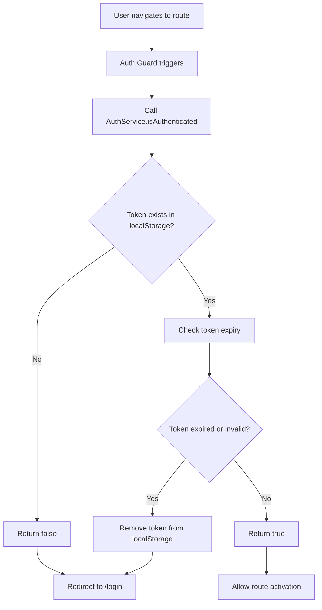

# Auth Flow

This page will describe the authentication flow from frontend to backend to frontend.

## Stage 1 - User accesses website

The default page `dashboard` is protected by an auth guard:

```ts
{ path: 'dashboard', component: ChoreDashboard, canActivate: [authGuard] }
```

The auth guard calls a method `isAuthenticated` on the `AuthService`. This method checks for the presence of an auth token in local storage, and whether it has expired. If the token has expired, it is automatically removed from local storage. If the token is invalid, it is treated as expired. If the `isAuthenticated` method returns false, the user is redirected to the login page. Otherwise, access is granted to the route.



## Stage 2 - User is redirected to login page

Assuming the user doesn't have a valid auth token, they will be redirected to the login page. Upon for submission, the users details are sent to the API where it'll be picked up by the `AuthController`. This injects an `AuthService` and a `TokenService`. The `Login` method on the `AuthService` is called which checks for the presence of a user with the provided email. If one exists, the password of the user found and the one sent in the request are verified. If they match, the user's details are returned and is then passed into a `CreateToken` method on the `TokenService`. This method will create a new JWT with the user's ID and email. This JWT will then be sent back to the front end. If the email does not match a user, or the password does not match, a `401 is returned by the controller.

## Stage 3 - User has authentication token

On successful login, the authentication token will be added to local storage. Then, all subsequent API calls can use the JWT. This means that specific user details like ID don't need to be sent in requests. A HTTP interceptor is used to append the JWT to the header of all requests. When the request reaches the API, it can automatically determine whether the token is valid from the validation parameters set:

```c#
options.TokenValidationParameters = new TokenValidationParameters
{
    ValidateIssuer = true,
    ValidateAudience = true,
    ValidateLifetime = true,
    ValidateIssuerSigningKey = true,
    ValidIssuer = builder.Configuration["Jwt:Issuer"],
    ValidAudience = builder.Configuration["Jwt:Audience"],
    IssuerSigningKey = new SymmetricSecurityKey(
        Encoding.UTF8.GetBytes(builder.Configuration["Jwt:Key"]))
};
```

If the token is valid, the user ID can be extrapolated from it:

```c#
var userId = User.FindFirst(ClaimTypes.NameIdentifier)?.Value;
```
